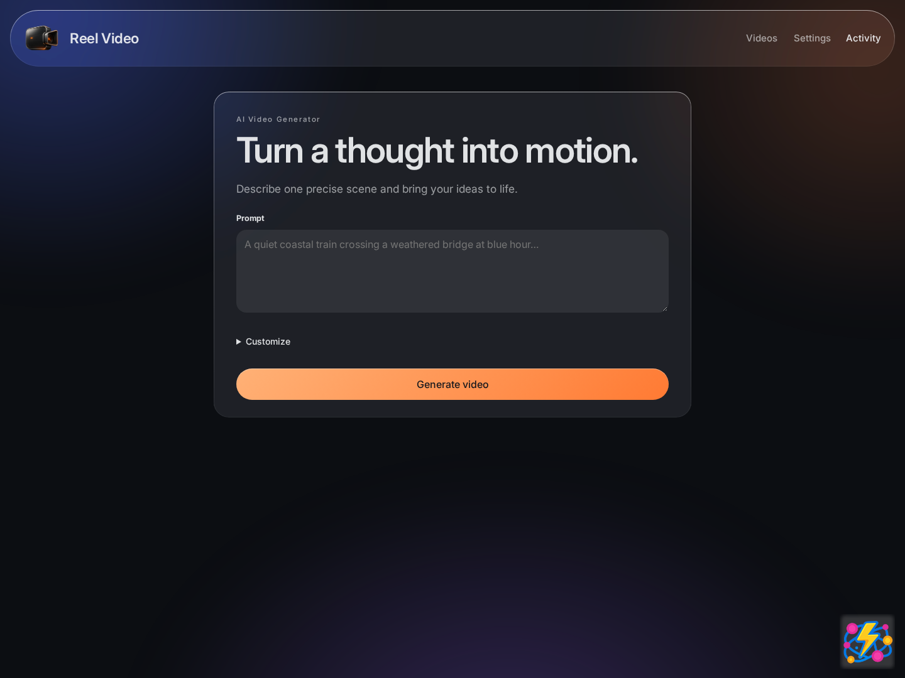

# Reel Video

[](https://github.com/spunkytensor/reel-video/actions/workflows/ci.yml)
[](https://github.com/spunkytensor/reel-video/actions/workflows/security.yml)

Reel Video is a browser-based video studio powered by MiniMax H3, running locally
with native stereo audio. One script starts both the studio and authenticated
HTTP API in a GPU-enabled Docker container.



> [!WARNING]
> **Private networks only — do not expose Studio or its API to the Internet.**
> Run this service only on a trusted private LAN or VPN, with firewall rules that
> block public access. Do not use public port forwarding, Internet-facing proxies,
> or public tunnels. Anyone who can reach the service can obtain a session without
> an API key and view, generate, or delete shared videos. The API key and Host/Origin
> checks do **not** restrict access to credential holders or isolate users.

## Requirements

- Linux with an NVIDIA RTX 5090 (32 GB VRAM). The 100 GiB available-RAM
  preflight is only a loading threshold: a measured two-reference run reached
  about 222 GiB host high-water RSS. Size RAM for the intended workload; see
  [hardware evidence and unverified profiles](VERIFICATION.md).
- Docker Engine with the
  [NVIDIA Container Toolkit](https://docs.nvidia.com/datacenter/cloud-native/container-toolkit/latest/install-guide.html).
- About 150 GB free for model weights, plus space for generated videos.
- A private-network deployment covered by your MiniMax license grant. The public
  community license does not authorize deployment in the US, EU, UK, or South
  Korea. See the [model license](https://huggingface.co/MiniMaxAI/MiniMax-H3/blob/main/LICENSE).

## Run

```bash
cp .env.example .env
chmod 600 .env
# Edit .env and set REEL_VIDEO_API_TOKEN to a unique secret of at least 32 ASCII characters.
./run.sh
```

The script reads trusted local shell configuration from `.env`, passes `REEL_VIDEO_API_TOKEN`
to the container, builds the image, and starts downloading pinned model weights.
It prints Studio URLs and returns while startup continues in the background.
Open a URL once startup completes; Studio creates an HttpOnly session automatically,
without asking for the API key. Anyone who can reach the configured private-network
Studio can use it, including reading and deleting shared jobs. REST clients can use
the key from `.env` or obtain the same automatic session. Host/Origin checks are
browser protections, not client authentication; there is no user isolation.
The key is never generated at startup, stored in the state volume, or printed in logs.

The header follows Reel Maestro: **Videos** shows a simple grid of video
previews and titles. Click a tile to open its detail screen, with information
and actions on the left and playback on the right. Download, reuse, and delete
controls live in that detail screen; **New video** opens the creation form and all its
options under Customize; **Activity** opens progress and cancellation controls.
Switching screens preserves the current creation form. Accepted generations open
Activity automatically, and the header shows how many videos are in progress.

Select videos using the checkbox at the upper-right of each tile to reveal **Delete**
in the header. Bulk deletion always asks for confirmation. Active videos cannot be
deleted; any failures are reported and remain selected. Leaving the library clears selection.

Studio shares Reel Maestro’s glass surfaces, orange primary action, typography,
and light/dark appearance. The supplied `logo.png` appears in the bottom-right
corner, matching Reel Maestro’s Studio branding. Use **Settings → Appearance** to choose System, Light, or Dark.
```bash
# Follow model-download, server, and generation progress.
docker logs --follow reel-video

# Stop the service. The volumes and their contents are retained.
./stop.sh
```

`stop.sh` uses the same `REEL_VIDEO_CONTAINER_NAME` configuration as `run.sh`, including
values in `.env`. It allows 25 seconds for graceful shutdown and succeeds if
the container is already gone. No bearer key is required to stop the service.

The script creates two Docker volumes:

- `reel-video-models` caches all model weights across container runs.
- `reel-video-state` stores the SQLite database, uploads, and videos.

Completed videos are retained for **3 days** by default. The media storage quota
is **25 GiB**. Set `REEL_VIDEO_RETENTION_DAYS` and `REEL_VIDEO_QUOTA_GIB` in `.env` to override
these values; `run.sh` forwards both settings to the container. Restart the
container to apply changes. Cleanup uses the configured retention period for
existing completed videos too; expired media is removed while job history remains.
The quota controls admission of new work rather than evicting retained videos.

The primary private IPv4 address and system FQDN are allowed automatically.
Override them with a comma-separated list when clients use other addresses or
DNS aliases. Each listed host is validated as private when the service starts:

```bash
REEL_VIDEO_NETWORK_HOSTS=gpu.example.internal REEL_VIDEO_PORT=8090 ./run.sh
```

Replace the example hostname with your server's private-network DNS name or IP address.

The listener is published on all host interfaces so both local and LAN clients
can connect. It serves plain HTTP: do not expose the port to the Internet. Use a
trusted LAN/VPN and firewall it to trusted clients.

## REST API

Protected API routes accept a bearer key or Studio session. These examples use
the key configured in `.env`:

```bash
export REEL_VIDEO_URL=http://127.0.0.1:8088
export REEL_VIDEO_TOKEN='your configured bearer key'

curl "$REEL_VIDEO_URL/health" -H "Authorization: Bearer $REEL_VIDEO_TOKEN"

curl "$REEL_VIDEO_URL/api/v1/videos" \
  -H "Authorization: Bearer $REEL_VIDEO_TOKEN" \
  -H 'Content-Type: application/json' \
  -d '{
    "model": "local/minimax-h3",
    "prompt": "A red fox walks through snowy pines. Soft wind and snow crunches, no music.",
    "duration": 5,
    "size": "960x544",
    "seed": 42,
    "generate_audio": true,
    "local": {"export": "original"}
  }'
```

Submission returns HTTP 202 with an `id` and `polling_url`. Main routes:

| Route | Purpose |
| --- | --- |
| `POST /api/v1/videos` | Queue a generation |
| `GET /api/v1/videos/{id}` | Poll job status |
| `POST /api/v1/videos/{id}/cancel` | Cancel an active generation |
| `GET /api/v1/videos/{id}/content?index=0` | Download the completed MP4 |
| `GET /api/v1/videos` | List persistent history |
| `GET /api/v1/videos/models` | Discover sizes, durations, images, and step options |
| `POST /api/v1/videos/images` | Upload a first/last frame or reference image |
| `GET /health` | Check service and worker health |

The default output is 960 × 544, 124 frames at 24 fps (about 5.17 seconds).
Supported API sizes are 960 × 544, 544 × 960, and 768 × 768; requested durations
are 5 or 10 seconds. The Studio defaults to 25 inference steps and exposes image conditioning, inference steps,
silent delivery, and orientation-aware 1080p export through capability discovery.
1080p delivery uses 1920 × 1080 for landscape, 1080 × 1920 for portrait, and
1080 × 1080 for square videos. Lanczos scaling preserves the source aspect ratio
with minimal padding where needed; it does not crop or stretch the video.
This applies to new exports; existing videos retain their original delivery dimensions.

Model loading and INT8 conversion take several minutes after each container
start, but downloaded weights remain cached. One GPU worker processes jobs
sequentially. SQLite preserves queued jobs and history across restarts.

For implementation details and measured hardware results, see
[IMPLEMENTATION.md](IMPLEMENTATION.md) and [VERIFICATION.md](VERIFICATION.md).

Studio design tokens and bundled Inter/JetBrains Mono fonts are adapted from
[Reel Maestro](https://github.com/spunkytensor/reel-maestro). Font licenses are included
in `assets/fonts/`.

## CI and security

The **CI** badge covers real CPU tests: Python request validation, authentication,
SQLite persistence, image decoding/uploads, FFmpeg encoding/decoding, and Chromium
against the actual HTTP server. Browser tests use temporary state and the real queue;
they do not intercept API responses or manufacture generated videos.

**Actual model execution requires an NVIDIA CUDA GPU. Hosted CI does not load weights,
run inference, or verify model output, quality, VRAM use, or GPU cancellation.**
A green CI badge is not a GPU-generation certification.

**CVE Audit** uses Syft SBOMs and Grype to check both source dependency inventories
and the built runtime image, including installed OS, Python and CUDA packages.
Unresolved High and Critical findings fail, including unfixed findings. Three
Python CPE false positives have exact-package VEX assessments backed by upstream
source and executable runtime checks; original matches and evidence remain in
the reports. The image uses pinned Wolfi/Python 3.12 packages and source-built
FFmpeg/PyAV rather than the vulnerable bundled media libraries. Reports are
retained even on failure. Badges reflect actual GitHub workflow results, not a
static “passing” label.

See [CI coverage, local commands, and security limitations](docs/ci.md).

## License, contributing, and publication status

Original application code is Copyright 2026 Spunky Tensor and licensed under
[Apache-2.0](LICENSE), matching Reel Maestro. Fonts and model components have
separate terms; see [third-party notices](THIRD_PARTY_NOTICES.md). The application
license does not grant MiniMax model, output, trademark, or artwork rights.

See [contribution guidelines](CONTRIBUTING.md), [security policy](SECURITY.md),
[data handling](docs/privacy.md), and the [publication checklist](docs/publication-readiness.md).
The GPU profile matrix remains partially verified. Public release is gated on
owner confirmation of model rights and release-candidate security checks;
the presence of policy files or badges alone is not publication approval.
